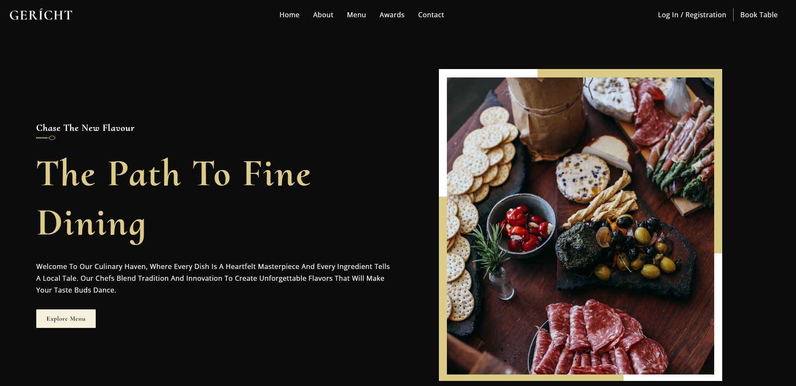

# Restaurant Landing Page
### [Live Site](https://liamt-ui-ux-restaurant.vercel.app)

## Breakdown
### Welcome to Gericht, a stunning restaurant website designed to captivate customers and viewers. This UI/UX project, built in React, focuses on maximizing the potential of React Functional components and their reusability.

### Key Features
- Well-organized React file and folder structure for easy navigation and maintenance.
- Utilization of fundamental CSS properties, including flex and grid, for seamless layout design.
- Implementation of the CSS BEM (Block Element Modifier) model for efficient and scalable styling.
- Incorporation of engaging animations and intricate gradients to enhance user experience.
- Implementation of responsive design with carefully crafted media queries to ensure optimal display on various devices.

